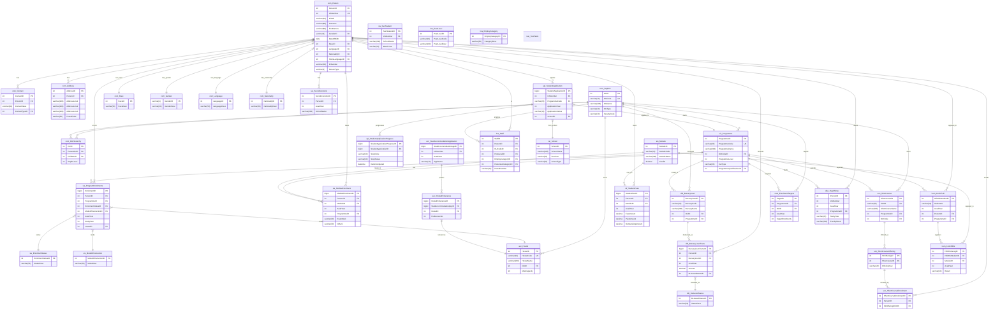

# ODS Entity Relationship Diagram (Mermaid)

```mermaid
erDiagram

    com_Person {
        int PersonID PK
        int USNumber UK
        varchar(10) Initials
        varchar(80) Surname
        varchar(80) FirstNames
        varchar(1) GenderID FK
        date DateOfBirth
        int RaceID FK
        int LanguageID FK
        int NationalityID FK
        int HomeLanguageID FK
        varchar(30) IDNumber
        varchar(1) PersonType
    }

    com_Contact {
        int ContactID PK
        int PersonID FK
        varchar(80) ContactValue
        int ContactTypeID FK
    }

    com_Address {
        int AddressID PK
        int PersonID FK
        varchar(200) AddressLine1
        varchar(200) AddressLine2
        varchar(200) AddressLine3
        varchar(50) PostalCode
    }

    com_OrgUnit {
        int OUID PK
        varchar(10) OUCode UK
        varchar(200) OUName
        varchar(10) OUType
        varchar(10) FacultyCode
    }

    com_OUHierarchy {
        int OUID PK
        int ParentOUID FK
        int ChildOUID FK
        int DepthLevel
    }

    com_Race {
        int RaceID PK
        varchar(50) RaceDesc
    }

    com_Gender {
        varchar(1) GenderID PK
        varchar(20) GenderDesc
    }

    com_Language {
        int LanguageID PK
        varchar(50) LanguageDesc
    }

    com_Nationality {
        int NationalityID PK
        varchar(50) NationalityDesc
    }

    sis_Programme {
        int ProgrammeID PK
        varchar(20) ProgrammeCode UK
        varchar(200) ProgrammeName
        int OUCodeID FK
        int ProgrammeLevel
        varchar(20) CerType
        int ProgrammeQualificationID FK
    }

    sis_ProgramEnrolments {
        bigint EnrolmentID PK
        int PersonID FK
        int ProgrammeID FK
        int EnrolmentStatusID FK
        int ModeOfInstructionID FK
        int AcadYear
        int StudyYear
        int HostelID FK
    }

    sis_Module {
        int ModuleID PK
        varchar(20) ModuleCode
        varchar(200) ModuleName
        decimal Credits
    }

    sis_ModuleEnrolment {
        bigint ModuleEnrolmentID PK
        int PersonID FK
        int ModuleID FK
        int AcadYear
        int ProgrammeID FK
        varchar(20) ExamMark
        varchar(20) CMark
    }

    sis_EnrolmentStatus {
        int EnrolmentStatusID PK
        varchar(50) StatusDesc
    }

    sis_ModeOfInstruction {
        int ModeOfInstructionID PK
        varchar(50) ModeDesc
    }

    sis_SocioEconomic {
        int SocioEconomicID PK
        int PersonID FK
        int AcadYear
        varchar(200) SchoolName
    }

    sis_SunStudent {
        int SunStudentID PK
        int USNumber FK
        varchar(200) SchoolName
        varchar(20) MatricYear
    }

    apl_StudentApplication {
        bigint StudentApplicationID PK
        int USNumber FK
        varchar(20) ProgrammeCode FK
        int ApplicationYear
        varchar(10) ApplicationStatus
        int SchoolID FK
    }

    apl_StudentApplicationProgress {
        bigint StudentApplicationProgressID PK
        bigint StudentApplicationID FK
        varchar(10) StepCode
        varchar(10) StepStatus
        datetime DateCompleted
    }

    acc_Hostel {
        int HostelID PK
        varchar(10) HostelCode UK
        varchar(200) HostelName
        int OUID FK
        int MaxCapacity
    }

    acc_StudAccommodationApplication {
        bigint StudAccommodationAppID PK
        int USNumber FK
        int AcadYear
        varchar(10) AppStatus
    }

    acc_HostelPreference {
        bigint HostelPreferenceID PK
        bigint StudAccommodationAppID FK
        int HostelID FK
        int PreferenceNo
    }

    dbl_BursaryLoan {
        int BursaryLoanID PK
        varchar(20) BursaryCode
        varchar(200) BursaryName
        int OUID FK
        int ProgrammeID FK
    }

    dbl_BursaryLoanTrans {
        bigint BursaryLoanTransID PK
        int PersonID FK
        int BursaryLoanID FK
        int AcadYear
        decimal Amount
        int BLAwardStatusID FK
    }

    dbl_BLAwardStatus {
        int BLAwardStatusID PK
        varchar(50) StatusDesc
    }

    hra_Staff {
        int StaffID PK
        int PersonID FK
        int OUCodeID FK
        int PostLevelID FK
        int EmployCategoryID FK
        int PersonnelCategoryID FK
        varchar(20) PersalNumber
    }

    hra_PostLevel {
        int PostLevelID PK
        varchar(10) PostLevelCode
        varchar(100) PostLevelDesc
    }

    hra_EmployCategory {
        int EmployCategoryID PK
        varchar(50) CategoryDesc
    }

    stf_StudentFees {
        bigint StudentFeeID PK
        int PersonID FK
        int ModuleID FK
        int AcadYear
        decimal FeeAmount
        decimal PaidAmount
        decimal OutstandingAmount
    }

    sco_Shortcourse {
        int ShortcourseID PK
        varchar(20) SCNR UK
        varchar(200) ShortCourseName
        int ProgrammeID FK
        int OUCode FK
    }

    sco_ShortCourseOffering {
        int SCOfferingID PK
        int ShortcourseID FK
        varchar(20) OfferingYear
    }

    sco_ShortCourseEnrollment {
        int ShortCourseEnrollmentID PK
        int PersonID FK
        int SCOfferingIDODS FK
    }

    hem_114STUD {
        int HEMISStudentID PK
        varchar(20) StudentNr
        int AcadYear
        int PersonID FK
        int ProgrammeID FK
    }

    hem_114CREG {
        int HEMISCeregID PK
        int HEMISStudentID FK
        int ModuleID FK
        int AcadYear
        varchar(10) Result
    }

    mds_EnrolmentTargets {
        int TargetID PK
        int ProgrammeID FK
        int OUID FK
        int AcadYear
        int TargetEnrolments
    }

    csr_School {
        int SchoolID PK
        varchar(200) SchoolName
        varchar(50) Province
        varchar(50) SchoolType
    }

    test_TestTable {}

    dbo_HealthOne {
        int PersonID FK
        int USNumber
        int AcadYear
        int ProgrammeID FK
        varchar(20) StudyYear
        varchar(200) FacultyDescr
    }

    %% ==================== RELATIONSHIPS ====================

    %% Person is the central hub
    com_Person ||--o{ com_Contact : "has"
    com_Person ||--o{ com_Address : "has"
    com_Person ||--o{ sis_ProgramEnrolments : enrols
    com_Person ||--o{ sis_ModuleEnrolment : takes
    com_Person ||--o{ sis_SocioEconomic : has
    com_Person ||--o{ dbl_BursaryLoanTrans : receives
    com_Person ||--o{ hra_Staff : is
    com_Person ||--o{ stf_StudentFees : owes
    com_Person ||--o{ sco_ShortCourseEnrollment : enrolls
    com_Person ||--o{ hem_114STUD : appears_in
    com_Person ||--o{ dbo_HealthOne : drives
    com_Person ||--o{ apl_StudentApplication : applies

    com_Person }|--|| com_Gender : has_gender
    com_Person }|--|| com_Race : has_race
    com_Person }|--|| com_Language : has_language
    com_Person }|--|| com_Nationality : has_nationality

    %% OrgUnit hierarchy
    com_OrgUnit ||--o{ com_OUHierarchy : "parent_of"
    com_OrgUnit ||--o{ com_OUHierarchy : "child_of"
    com_OrgUnit ||--o{ sis_Programme : owns
    com_OrgUnit ||--o{ acc_Hostel : owns
    com_OrgUnit ||--o{ hra_Staff : employs
    com_OrgUnit ||--o{ dbl_BursaryLoan : manages
    com_OrgUnit ||--o{ mds_EnrolmentTargets : targets
    com_OrgUnit ||--o{ sco_Shortcourse : offers

    %% Programme and enrolments
    sis_Programme ||--o{ sis_ProgramEnrolments : has
    sis_Programme ||--o{ sis_ModuleEnrolment : has
    sis_Programme ||--o{ dbl_BursaryLoan : linked_to
    sis_Programme ||--o{ mds_EnrolmentTargets : targeted
    sis_Programme ||--o{ sco_Shortcourse : extends
    sis_Programme ||--o{ hem_114STUD : reported
    sis_Programme ||--o{ dbo_HealthOne : feeds

    sis_ProgramEnrolments }|--|| sis_EnrolmentStatus : status
    sis_ProgramEnrolments }|--|| sis_ModeOfInstruction : mode
    sis_ProgramEnrolments }|--|| acc_Hostel : resides

    %% Module enrolments
    sis_Module ||--o{ sis_ModuleEnrolment : taken_in
    sis_Module ||--o{ stf_StudentFees : cost_for
    sis_Module ||--o{ hem_114CREG : reported_in

    %% Applications pipeline
    apl_StudentApplication ||--o{ apl_StudentApplicationProgress : progresses
    apl_StudentApplication }|--|| sis_Programme : applies_to
    apl_StudentApplication }|--|| csr_School : from_school

    %% Accommodation
    acc_StudAccommodationApplication ||--o{ acc_HostelPreference : prefers
    acc_HostelPreference }|--|| acc_Hostel : references

    %% Bursaries & Loans
    dbl_BursaryLoan ||--o{ dbl_BursaryLoanTrans : disbursed_as
    dbl_BursaryLoanTrans }|--|| dbl_BLAwardStatus : awarded_as

    %% Short Courses
    sco_Shortcourse ||--o{ sco_ShortCourseOffering : offered_as
    sco_ShortCourseOffering ||--o{ sco_ShortCourseEnrollment : enrolled_by

    %% HEMIS
    hem_114STUD ||--o{ hem_114CREG : registers

```
